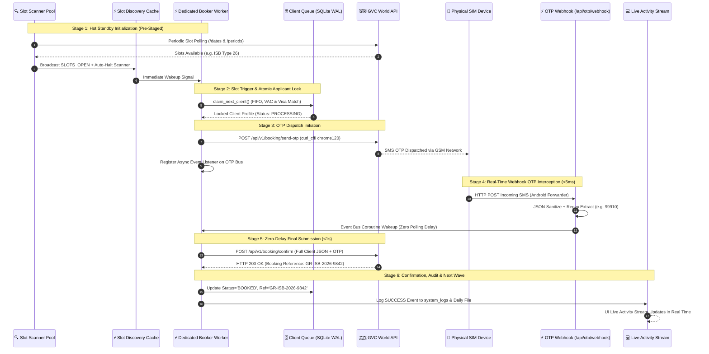

# Dual-Pool Fleet Architecture, High-Demand Operations Coordinator & Persistent Activity Stream

**Kamal Express AI Platform** — Advanced Technical Specification & Enterprise Operations Plan.

---

## 1. Executive Summary & Design Principles

This document specifies the enterprise architecture for the Kamal Express appointment automation engine to coordinate multi-account parallel operations during high-demand appointment release windows (e.g. Greece Long-Term Type D Seasonal Work, Schengen C).

### Key Architectural Standards:
1. **Event Bus & Logger Performance (In-Process Async Queue + SQLite WAL vs. Redis):**
   * **Verdict on Redis:** An external Redis cluster adds unnecessary DevOps deployment overhead and port management without latency benefit for our multi-account scale (<50 parallel workers).
   * **Engine Implemented:** An in-process non-blocking `asyncio.Queue` + thread-safe `collections.deque` (last 200 events) combined with SQLite WAL (`system_logs` table) and daily partitioned log files (`logs/activity_YYYY-MM-DD.log`).
   * **Latency:** Under `<0.05ms` per event emission, zero external dependencies, 100% resilient across container restarts.
   * **Interface Modularity:** Built on an abstract Pub/Sub interface (`BaseEventBus`), making it drop-in Redis compatible if distributed multi-server clustering is ever required in the future.

2. **Dual-Pool Capability Segregation (`SLOT_CHECKER` vs `BOOKER` vs `HYBRID`):**
   * **Admin/Staff Registration:** All GVC portal accounts are registered and managed by staff in the **GVC Auth & Sessions** management center. Staff assign each account its operational capability:
     * `Slot Scanner (Availability Checker)`
     * `Dedicated Booker (Execution Specialist)`
     * `Autonomous (Hybrid Scanner + Booker)`
   * **Rate-Limit & Session Health Protection:** Dedicated Bookers do not perform repetitive slot polling, keeping their authentication tokens clean, fresh, and completely protected from rate limits.

3. **High-Demand Booking Operations Coordinator ("Pre-Stage Booking Fleet"):**
   * Embassy slot openings are often pre-scheduled or notified in advance (e.g. 19:00 PKT).
   * Operators can schedule a release window timer or click **"Pre-Stage Active Booking Fleet"**, which pre-heats session tokens, tests proxies, and loads applicant profiles into hot memory cache.

4. **PII Data Privacy, Phone Masking & Click-to-Reveal Standard:**
   * **Default Masking:** In strict compliance with PII data privacy guidelines, all applicant phone numbers, passport numbers, and SIM numbers displayed across the UI tables, activity streams, and operational cards are masked by default (e.g. `+92-334-***-2969` or `PK-****567`).
   * **Click-to-Reveal with Confirmation Dialog:** When an operator clicks on a masked number or the reveal icon (`👁`), a concise confirmation dialog appears:
     > *"⚠️ Confirm PII Access: You are about to reveal sensitive client contact data. This action will be recorded in system audit logs under Kamal Express Data Privacy Policy. Proceed?"*
   * **In-Place Temporary Unmasking:** Upon operator confirmation, the number is unmasked in-place for that session, and an `INFO` audit event is logged to `system_logs` (`[AUTH/PII] Operator 'ali' unmasked phone for Client #12`).

5. **Bulk CSV / TXT Queue Intake with Downloadable Sample Template:**
   * Staff upload batches of 10, 50, 100 applicants via CSV or formatted TXT.
   * A ready-to-use template (`client_queue_template.csv`) is provided for 1-click download directly inside the upload dialog.
   * Multi-worker waves execute automatically (e.g. 5 active bookers process Applicants 1–5 in Wave 1, then immediately claim Applicants 6–10 in Wave 2 until the queue is clear).

6. **Remote Worker Personas (Professional Distributed Agency Team):**
   * Booker workers are presented in the UI as a professional distributed team of Pakistani remote operators (Muslim & Christian names, e.g. *Tariq Mehmood*, *Yaqoob Masih*, *Hamza Malik*, *Daniel Gill*).

---

## 2. High-Level System Architecture

```mermaid
flowchart TD
    Staff[👤 Staff / Admin] -->|1. Upload Bulk CSV with Template| ClientQueue[(🗄️ SQLite client_queue)]
    Staff -->|2. Schedule Release Window / Click Pre-Stage| OperationsCoordinator[🎯 Operations Coordinator & Readiness Briefing]
    
    subgraph DualPoolFleet ["🛡️ Dual-Pool Multi-Account Fleet (Staff Registered)"]
        subgraph DiscoveryPool ["🔍 Pool A: Slot Checkers (1-2 Accounts)"]
            Checker1[🤖 Operator: Tariq Mehmood - Scanner]
            Checker1 -->|Polls /dates & /periods| SharedCache[⚡ SlotDiscoveryCache 3-5m TTL]
            SharedCache -->|Slot Detected| AutoHalt[🛑 Auto-Halt Availability Checks]
        end

        subgraph BookingPool ["⚡ Pool B: Pre-Staged Bookers (N Accounts)"]
            Worker1[🤖 Operator: Yaqoob Masih]
            Worker2[🤖 Operator: Hamza Malik]
            WorkerN[🤖 Operator: Daniel Gill]
        end
    end

    SharedCache -->|Broadcast 'SLOTS_OPEN' Event| BookingPool
    AutoHalt -->|Broadcast 'SCAN_PAUSED'| SharedCache

    subgraph BookerExecution ["🚀 Instant Booking Pipeline (<1s)"]
        BookingPool -->|Atomic Lock| Claimer[claim_next_client FIFO]
        Claimer --> ClientQueue
        BookingPool -->|Trigger OTP| GVCAPI[🇬🇷 GVC World API]
        AndroidPhones[📱 Physical Android SIM Phones] -->|Incoming SMS| Webhook[/api/otp/webhook]
        Webhook -->|Event Bus Code Wakeup| BookingPool
        BookingPool -->|Submit Final Payload| GVCAPI
    end

    subgraph LoggingSubsystem ["⚡ Unified Persistent Activity Stream"]
        DualPoolFleet --> Logger[Central Event Logger]
        Webhook --> Logger
        Logger --> InMemBuffer[(In-Memory Deque - 200 Events)]
        Logger --> SQLiteAudit[(🗄️ SQLite system_logs)]
        Logger --> DailyLogFiles[(📁 logs/activity_YYYY-MM-DD.log)]
        InMemBuffer --> StreamAPI[/api/logs/stream & /api/logs/export]
        StreamAPI --> UIDashboard[💻 UI Live Activity Stream + Controls]
    end
```

---

## 3. End-to-End Automated Booking Execution Workflow

The automated booking pipeline executes across 6 deterministic stages designed to minimize latency from slot detection to confirmed appointment submission:



### Detailed Workflow Stages:

1. **Stage 1: Hot Standby Booker Initialization (Pre-Staged Fleet)**
   * Booker instances are pre-authenticated with active JWT Bearer tokens and cookies.
   * Residential proxy tunnels are pre-tested and active.
   * Persistent HTTP keep-alive connections to `pk-gr-services.gvcworld.eu` are maintained via `curl_cffi` (impersonating `chrome120`).
   * Dedicated SIM phone numbers (`otp_phone_number`, e.g., `+92-334-***-2969`) are bound to each booker instance.

2. **Stage 2: Slot Trigger & Atomic Applicant Lock**
   * Upon receiving `SLOTS_OPEN` from `SlotDiscoveryCache`, the booker immediately executes `claim_next_client()` against `client_queue`.
   * **Atomic Concurrency:** The client record is atomically transitioned to `status = 'PROCESSING'` and tagged with `locked_by_worker = account_id` using SQLite `BEGIN IMMEDIATE` / `RLock` to prevent race conditions across parallel bookers.
   * **Client Preference Precedence:** The booker extracts VAC (`client.vac_id`) and Visa Category (`client.visa_type`) directly from the claimed client's profile, overriding account default settings.
   * Earliest available date (`preferred_date_start` constraint respected) and earliest slot time period are selected.

3. **Stage 3: OTP Dispatch Initiation**
   * Booker dispatches the initial appointment verification request (`POST /api/v1/booking/send-otp`) to GVC World API.
   * GVC initiates an SMS dispatch to the account's registered SIM phone number.
   * The booker coroutine registers a high-speed in-memory event listener on `Universal OTP Event Bus`, waiting specifically for an OTP mapped to its assigned SIM number.

4. **Stage 4: Real-Time Webhook OTP Interception (<5ms)**
   * The physical Android device receives the SMS from Gerrys / GVC.
   * The Android SMS Forwarder application relays the raw SMS payload via HTTP POST to `https://<domain>/api/otp/webhook`.
   * **Sanitization & Extraction:**
     * `_sanitize_json_payload()` normalizes unquoted leading-zero numbers.
     * Universal regex matches Gerrys/GVC patterns (4–8 digit codes) in `<0.05ms`.
   * The Event Bus immediately wakes the waiting Booker worker coroutine (zero polling delay).

5. **Stage 5: Zero-Delay Final Booking Submission via `curl_cffi` (<1s)**
   * Booker constructs the complete applicant booking payload:
     ```json
     {
       "vac_id": 138,
       "visa_type_id": 26,
       "appointment_date": "2026-10-07",
       "period_id": 4821,
       "first_name": "Muhammad",
       "last_name": "Tariq",
       "passport_number": "PK1234567",
       "dob": "1992-08-15",
       "passport_expiry": "2032-05-10",
       "phone": "+923001234567",
       "email": "tariq@example.com",
       "otp_code": "99910"
     }
     ```
   * Submits `POST /api/v1/booking/confirm` using `curl_cffi` with exact `chrome120` TLS fingerprint and standardized Chrome desktop headers.

6. **Stage 6: Confirmation, Audit Broadcast & Multi-Wave Continuation**
   * Booker extracts the confirmed Booking Reference (e.g. `GR-ISB-2026-9842`).
   * Atomically updates `client_queue` (`status = 'BOOKED'`, `booking_reference = 'GR-ISB-2026-9842'`, `booked_at = datetime.utcnow()`).
   * Emits a `SUCCESS` event to `system_logs` and daily rotating log file (`data/logs/activity_YYYY-MM-DD.log`).
   * Broadcasts to UI Activity Stream (`[BOOKING] Successfully booked appointment for Client: Muhammad Tariq (Ref: GR-ISB-2026-9842)`).
   * **Multi-Wave Processing:** If pending applicants remain in `client_queue`, the booker immediately loops back to Stage 2 to claim the next applicant in Wave 2; otherwise, it returns to idle hot-standby.

---

## 4. Subsystem Technical Specifications

### Subsystem 1: Unified Activity Stream & Persistent Logging
* **SQLite Table:** `system_logs`
  * `id` INTEGER PRIMARY KEY AUTOINCREMENT
  * `timestamp` REAL (Epoch seconds)
  * `created_at` TEXT (ISO UTC format)
  * `level` TEXT (`SUCCESS`, `INFO`, `WARNING`, `ERROR`, `AUTH`)
  * `category` TEXT (`BOOKING`, `SLOT_DISCOVERY`, `OTP`, `AUTH`, `FLEET`, `SYSTEM`)
  * `account_id` INTEGER (Optional GVC account binding)
  * `worker_name` TEXT (e.g. "Yaqoob Masih")
  * `message` TEXT
  * `details_json` TEXT
* **Log Rotation:** Daily files created at `data/logs/activity_YYYY-MM-DD.log`.
* **API Endpoints:**
  * `GET /api/logs/stream?limit=50&category=...` — Real-time event log polling.
  * `GET /api/logs/export?format=json|log` — Instant log archive export.
  * `DELETE /api/logs/clear` — Clear log stream (Admin only).
* **UI Controls:**
  * Configurable Refresh Speed: `[ 3s | 5s | 15s | 30s | 1m | 5m | ⏸ Paused ]`.
  * Pause/Resume toggle button for frozen inspection.
  * Instant 1-click **Export Logs** button.
  * Color-coded semantic tags:
    * 🟢 **`BOOKED` / `SUCCESS`:** Bold Green badge.
    * 🔵 **`SLOTS FOUND` / `SCAN`:** Vibrant Blue badge.
    * 🟠 **`OTP INTERCEPT`:** Amber / Orange badge.
    * 🔴 **`AUTH` / `LOGIN FAILED` / `SESSION EXPIRED`:** Prominent Red badge.

---

### Subsystem 2: Dual-Pool Capability Management
* **Database Extension (`gvc_portal_accounts`):**
  * `account_role`: `SLOT_CHECKER`, `BOOKER`, `HYBRID` (Default: `HYBRID`).
  * `worker_persona_name`: Assigned Pakistani operator name (e.g. "Yaqoob Masih").
  * `target_date_from`: Earliest acceptable slot date for that worker.
* **Auto-Halt Mechanism on Slot Discovery:**
  * When `SLOT_CHECKER` detects open slots, it writes the slot info into `SlotDiscoveryCache`, broadcasts a wake-up signal to the `BOOKER` pool, and sets its own scanning status to `SLOTS_FOUND_HALTED`.
  * Scanning remains halted until all matching queued clients are booked or until Admin clicks **"Reschedule Slot Checks"** in the dashboard.

---

### Subsystem 3: High-Demand Operations Coordinator & Pre-Staging
* **Operational Controls:**
  * **"Pre-Stage Active Booking Fleet" (Hot Standby):**
    1. Tests proxy connectivity and refreshes session tokens if expired.
    2. Pre-warms HTTP keep-alive connection pool to `pk-gr-services.gvcworld.eu`.
    3. Loads queued applicants matching the target VAC and Visa Type into hot memory cache.
  * **Scheduled Release Window Coordinator:**
    * Allows setting target Release Date/Time (e.g. `30/09/2026 19:00:00 PKT`).
    * Displays live countdown timer on the operations dashboard.
    * Automatically initializes Pre-Stage Hot Standby 60 seconds prior to release time.
* **Operations Plan & Readiness Briefing Card:**
  * Displays:
    * Total Queued Clients vs. Active Booker Count.
    * Multi-wave booking forecast (e.g. "10 Clients $\to$ 5 Bookers in 2 Waves").
    * Staff Operational Readiness Checklist:
      * [x] Android SMS Forwarder Active on SIM devices (`+92-334-***-2969`).
      * [x] GVC Portal Accounts Authenticated.
      * [x] Pakistan Residential Proxy Pool Online.

---

### Subsystem 4: Bulk CSV / TXT Intake & Template Generator
* **Endpoints:**
  * `GET /api/clients/template` — Generates and downloads `client_queue_template.csv`.
  * `POST /api/clients/bulk-upload` — Ingests CSV or line-by-line formatted TXT files.
* **CSV Template Schema:**
  ```csv
  first_name,last_name,passport_number,dob,passport_expiry,phone_number,email,vac_id,visa_type,preferred_date_start,notes
  Muhammad,Tariq,PK1234567,15/08/1992,10/05/2032,3001234567,tariq@example.com,138,26,07/10/2026,Seasonal Worker
  Ali,Ahmed,PK7654321,22/11/1990,14/09/2031,3345556677,ali.ahmed@example.com,138,26,07/10/2026,Seasonal Worker
  ```
* **Multi-Wave Execution:**
  * Fully automated FIFO claiming across available bookers until all queued clients are booked.

---

### Subsystem 5: Remote Worker Personas Catalog
* Built-in diverse Pakistani names assigned to workers:
  1. *Tariq Mehmood*
  2. *Yaqoob Masih*
  3. *Hamza Malik*
  4. *Farooq Ahmed*
  5. *Daniel Gill*
  6. *Bilal Shah*
  7. *Yousaf Bhatti*
  8. *Rashid Minhas*
* Displayed in UI with masked PII:
  `[ 🤖 Tariq Mehmood (ISB - Type 26) | SIM: +92-334-***-2969 | Status: PRE-STAGED ]`

---

## 5. Implementation Schedule & Verification Plan

| Phase | Milestone | Deliverables |
| :--- | :--- | :--- |
| **Phase 1** | **Unified Persistent Activity Stream** | `system_logs` SQLite table, daily rotating files in `data/logs/`, `GET /api/logs/stream`, `GET /api/logs/export`, UI with auto-refresh speed selector, Pause/Resume, Red `AUTH` highlights. |
| **Phase 2** | **Dual-Pool Roles & Shared Cache** | `account_role` in `gvc_portal_accounts`, `SlotDiscoveryCache` (3-5m TTL), Auto-Halt on slot discovery with manual reschedule button. |
| **Phase 3** | **Operations Coordinator & Pre-Staging** | Countdown timer, "Pre-Stage Active Booking Fleet" button, Operations Plan & Readiness Briefing card with multi-wave breakdown and staff checklist. |
| **Phase 4** | **Bulk CSV / TXT Queue Upload & Template** | File upload modal, downloadable template `GET /api/clients/template`, batch ingestion endpoint, wave queue processing tests. |
| **Phase 5** | **Remote Worker Personas & Polish** | Humanized worker names, PII phone masking, visual status cards, end-to-end integration tests. |
