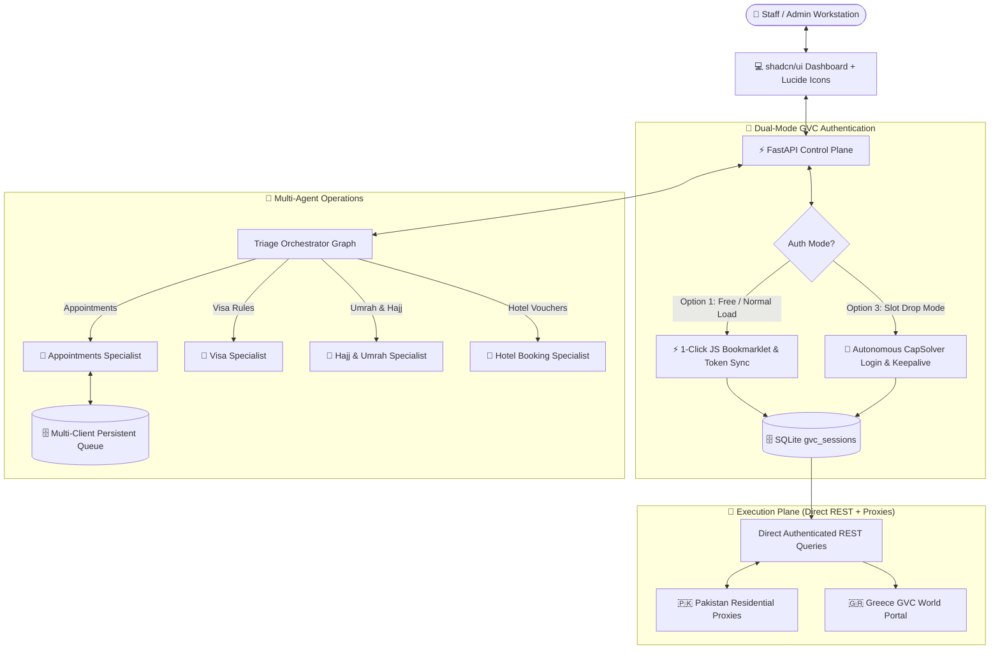

# 🌍 Kamal Express AI Platform

**Autonomous Multi-Agent Travel & Visa Appointment Booking Platform** powered by LangGraph, FastAPI, SQLite WAL, and Dual-Mode GVC Automation.

Deployed live on Hetzner VPS with Portainer & Cloudflare Tunnel (`https://keportal.alamiaconnect.com`).

---

## 🏗 System Architecture



---

## 🌟 Key Modules & Features

### 1. 🔐 Dual-Mode GVC Authentication
- **Option 1: Manual 1-Click Browser Sync (Zero Cost / Normal Hours)**
  - Staff logs into GVC on their physical workstation.
  - With 1 click on the drag-and-drop JavaScript bookmarklet, the active session token is synced to the VPS backend.
  - Option 3 auto-solver is **PAUSED** to save captcha solving costs.
- **Option 3: Autonomous Auto-Solver (Slot Drop / High Load Hours)**
  - Background worker (`solver_worker.py`) uses CapSolver/2Captcha to solve reCAPTCHA v2/v3 autonomously, logs in with saved credentials, and maintains fresh session tokens 24/7.
  - Automatic recovery upon HTTP 401/403 session expiration.

### 2. 🎨 Modern shadcn/ui Dashboard (`api/static/index.html`)
- Built following **shadcn/ui design tokens** with typography set to `Inter`.
- 100% vector **Lucide SVG Icons** (`bot`, `calendar`, `file-text`, `sparkles`, `building-2`, `shield-check`, `globe-2`, `users`, `search`).
- Segmented control navigation, Radix-style modals with backdrop blur, and live telemetry badges.

### 3. 🧠 Multi-Agent Travel Specialist Operations
- **🤖 Orchestrator Agent (`agents/orchestrator/`):** Triage router delegating user intent to specialized sub-agents.
- **📅 Appointments Specialist (`agents/appointments/`):** Intake applicants into queue, search live slots, trigger OTPs, and book appointments.
- **🛂 Visa Specialist (`agents/visa/`):** Greece Type 26 (Seasonal Work), Schengen Type C, National Type D, KSA, UAE, and UK document requirements & embassy fees.
- **🕋 Hajj & Umrah Specialist (`agents/umrah/`):** Package cost calculator (Economy, 4-star, 5-star VIP), Nusuk Rawdah permit timings, Tasheer biometrics, and Ziyarat guides.
- **🏨 Hotel Booking Specialist (`agents/hotels/`):** Instant hotel discovery and confirmed provisional reservation vouchers in Makkah, Madinah, Athens, and Dubai.

### 4. 🗄️ Thread-Safe SQLite Persistence (`agents/appointments/db.py`)
- Configured with Write-Ahead Logging (`WAL`) mode for concurrent multi-staff reads/writes.
- Tables: `client_queue`, `proxies`, `users`, `sessions`, `visa_rules`, `hotels`, `hotel_bookings`, `gvc_sessions`, `system_settings`.

---

## 🚢 Quick Start & VPS Deployment

### Local Development
```powershell
# 1. Activate virtual environment
.\venv\Scripts\Activate.ps1

# 2. Run API server
uvicorn api.main:app --host 0.0.0.0 --port 8080 --reload
```

### Portainer VPS Deployment
1. Set Stack Repository: `https://github.com/KamalExpress/KamalExpress-Agents.git` (branch: `refs/heads/main`).
2. Compose path: `docker-compose.yml` (maps host port `8085` $\to$ container `8080`).
3. Set environment variables from `portainer.env.example`.
4. Point Cloudflare Tunnel hostname `keportal.alamiaconnect.com` to `http://localhost:8085`.

---
*Maintained by Kamal Express Operations & Engineering Team.*
