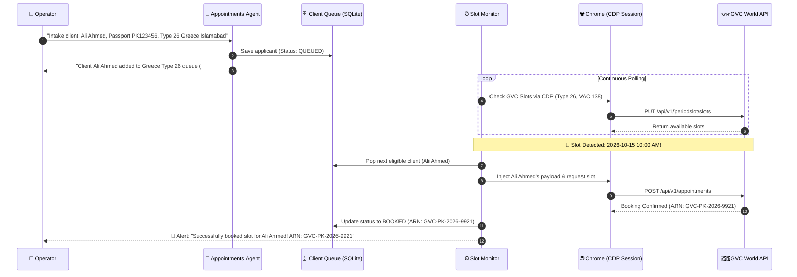

# 🌍 Kamal Express AI Agents

**Autonomous Multi-Agent Travel & Visa Appointment Booking Platform** powered by LangGraph, FastAPI, and Chrome DevTools Protocol (CDP) browser automation.

Designed following open-source agent coworker architectures (leveraging 100% OSS components from [CopilotKit OpenBot](https://github.com/CopilotKit/openbot) without any paid cloud dependencies or proprietary lock-in), Kamal Express Agents provides specialized AI agents capable of multi-client data intake, persistent queue management, automated slot monitoring, and autonomous embassy appointment booking on Greece (GVC World) and other visa portals using live authenticated Chrome sessions.

---

## 🏗 System Architecture

```mermaid
flowchart TD
    User([👤 Operator / Travel Agent]) <--> WebUI[💻 Open-Source Agent Web UI / AG-UI]
    WebUI <--> API[⚡ FastAPI Gateway /api/main.py]

    subgraph Orchestration ["🧠 Orchestration & Queue Management"]
        API <--> Router[Triage Router / Intent Classifier\n(gemma3:1b / llama-3.1-8b)]
        Router -->|Visa Inquiries| VisaAgent[🛂 Visa Requirements Agent\n(qwen2.5:7b / gpt-4o-mini)]
        Router -->|Client Intake & Booking| ApptAgent[📅 Appointments & Booking Agent\n(qwen3.5:4b / gpt-4o-mini)]
        ApptAgent <--> ClientDB[(🗄️ Multi-Client Persistent Queue\nPassports, Profiles & Preferences)]
    end

    subgraph ExecutionPlane ["🖥️ Execution & Background Monitoring Engine"]
        ApptAgent --> SlotScheduler[⏰ Autonomous Slot Monitor & Booker\n(Adapted from proven GVC engine)]
        SlotScheduler <--> StealthBrowser[Stealth Browser Manager\n(CDP & Playwright)]
        StealthBrowser <-->|ws://localhost:9222| ChromeCDP[🌐 System Google Chrome\n(Real User Profile, Cookies & WAF Bypass)]
        StealthBrowser -.->|Fallback| HeadlessChromium[Headless Chromium]
        StealthBrowser --> Captcha[🧩 2Captcha / CapSolver / Turnstile]
        StealthBrowser --> Proxies[🛡️ Proxy Manager (Residential / Rotating)]
    end

    subgraph Portals ["🏛️ Embassy & Visa Portals"]
        ChromeCDP --> GVC[🇬🇷 Greece Portal (GVC World)\nType 26, Type C, Type D]
        ChromeCDP --> VFS[🇬🇧 VFS Global]
        ChromeCDP --> BLS[🇪🇸 BLS International]
        ChromeCDP --> TLS[🇫🇷 TLScontact]
    end
```

---

## 📊 Current Implementation Status

### ✅ What is Setup & Operational

1. **Multi-Agent Orchestration & State Graphs (`agents/`):**
   - **Triage Orchestrator (`agents/orchestrator/`):** Sub-100ms intent classification routing queries to specialized agents (`visa`, `appointments`, `general`, `clarify`).
   - **Visa Requirements Agent (`agents/visa/`):** LangGraph ReAct agent handling document checklists, fee estimation, application status, and embassy center lookups.
   - **Appointments Agent Framework (`agents/appointments/`):** Core ReAct graph with slot search, booking, and cancellation tool definitions.

2. **Pluggable AI Provider Layer (`providers/`):**
   - Universal provider interface supporting 100% self-hosted or open-source configurations:
     - **Ollama** (Local execution: `qwen2.5:7b`, `gemma3:1b`, `qwen3.5:4b`)
     - **OpenRouter** (Pay-per-token cloud: `gpt-4o-mini`, `llama-3.1-8b`)
     - **OpenAI** (`gpt-4o-mini`, `gpt-4o`)
     - **Anthropic** (`claude-3-5-haiku`, `claude-3-5-sonnet`)
   - Granular per-agent model assignment via central settings.

3. **Stealth Browser & CDP Engine (`agents/appointments/browser.py`):**
   - **CDP Mode (Primary):** Attaches via Chrome DevTools Protocol (`ws://localhost:9222`) to a running instance of Google Chrome on the host machine. Reuses existing session cookies, saved logins, and authentic user fingerprints to bypass WAFs (Imperva, Cloudflare, Akamai).
   - **Local Mode (Fallback):** Headless Chromium with Playwright anti-detection script injection (`navigator.webdriver` removal, custom user agents, realistic delays).
   - **Windows CDP Helper:** [`Launch-Chrome-CDP.ps1`](file:///E:/Alamia/KamalExpress-Agents/Launch-Chrome-CDP.ps1) script to start system Chrome in debug mode.

4. **Security & Proxy Infrastructure:**
   - Multi-vendor CAPTCHA solving hooks (`2captcha`, `capsolver`, `anticaptcha`) for reCAPTCHA v2, hCaptcha, and Cloudflare Turnstile.
   - Proxy manager supporting static, rotating, and BrightData residential proxies.

5. **API & Interface:**
   - FastAPI server ([`api/main.py`](file:///E:/Alamia/KamalExpress-Agents/api/main.py)) with Server-Sent Events (SSE) streaming for real-time agent output.
   - Web Chat UI in [`api/static/index.html`](file:///E:/Alamia/KamalExpress-Agents/api/static/index.html).
   - Docker containerization (`Dockerfile`, `docker-compose.yml`).

---

### ⏳ What is Pending / Roadmap (Priority Order)

1. **🇬🇷 Greece Portal (GVC World) Concrete Automation (Top Priority):**
   - Adapt proven GVC endpoints, payloads, and VAC IDs directly from the production-tested bookingbot core:
     - **Supported GVC Visa Types:**
       - `26`: Long-Term Type D (Seasonal / Dependent Employment) *(Default / High Demand)*
       - `0`: Submission Schengen Visa (Short term - Type C)
       - `2`: National visa (Long term - type D)
       - `5`: Premium Lounge *(Optional)*
       - `6`: Prime Time *(Optional)*
     - **VAC Center IDs:** Islamabad (`138`), Karachi (`137`), Lahore (`139`).
     - **API Endpoints:** Slot discovery (`PUT /api/v1/periodslot/slots`), OTP trigger (`POST /api/v1/onetimepassword/sendOtpBookAppointment`), and final booking (`POST /api/v1/appointments`).
     - Automated CDP session validation, calendar slot scanning, and payload injection.

2. **🗂️ Multi-Client Intake & Persistent Queue Engine:**
   - Conversational intake in Appointments Agent to ingest single or bulk applicant records.
   - Persistent client database / queue (SQLite / JSON) storing:
     - Passport details: Number, Issue Date, Expiry Date, Issue Place.
     - Personal details: First Name, Last Name, Gender, Date of Birth, Nationality (`197` for Pakistan), Marital Status.
     - Contact info: Phone Number, Email, Residential Address.
     - Target preferences: Destination (`Greece`), Visa Type (`26`), Center (`Islamabad`/`Karachi`/`Lahore`), Preferred Date Range.
     - Status: `QUEUED`, `IN_PROGRESS`, `BOOKED`, `CANCELLED`.
   - **Autonomous Execution:** When slots become available, the agent pulls the next eligible queued client and completes the booking automatically without requiring real-time operator prompts.

3. **⏰ Background Slot Monitoring & Auto-Booking Scheduler:**
   - Autonomous background scheduler (adapted from worker slot monitor) that continuously checks for open slots on GVC Greece via CDP or authenticated session requests.
   - Instant auto-booking trigger: as soon as a slot is detected, the worker acquires the slot and books it for the top eligible client in the queue.

4. **🤖 Open-Source CopilotKit / AG-UI Visual Components:**
   - Pure open-source UI widgets (zero paid cloud dependencies):
     - Multi-client queue management table.
     - Live slot monitoring dashboard and activity feed.
     - Client verification and booking confirmation cards.

5. **📚 RAG Knowledge Base (`rag/`):**
   - *(Planned for future phase)* ChromaDB vector store ingestion for Greece and Schengen visa regulations, required documentation checklists, and embassy policies.

---

## 🇬🇷 Greece Portal (GVC) Booking Workflow Details

The Greece Portal automation operates in two modes:

### Mode 1: Fully Autonomous Background Auto-Booking (Primary)


### Mode 2: Interactive Conversational Booking
- Operator interacts directly in the chat interface.
- Agent inspects live slots on demand, displays available times, confirms client details, and submits the booking.
- If GVC requests an SMS/email OTP, the agent prompts the operator in chat and submits the OTP immediately upon entry.

---

## 🚀 Quick Start

### 1. Prerequisites
- Python 3.10+
- Google Chrome (installed on host)
- Ollama (for free local models) or OpenRouter / OpenAI API key

### 2. Setup Environment
```powershell
# Navigate to project directory
cd E:\Alamia\KamalExpress-Agents

# Create and activate virtual environment
python -m venv venv
.\venv\Scripts\Activate.ps1

# Install dependencies
pip install -r requirements.txt
playwright install chromium
```

### 3. Configure `.env`
Copy `.env.example` to `.env` and configure your settings:
```ini
AI_PROVIDER=openrouter  # or ollama / openai / anthropic
OPENROUTER_API_KEY=your_key_here

BROWSER_MODE=cdp
BROWSER_CDP_URL=ws://localhost:9222
```

### 4. Launch Chrome with CDP
Start your system Chrome with remote debugging and your personal profile:
```powershell
.\Launch-Chrome-CDP.ps1 -RealProfile -NoProxy
```
*Log into GVC World (Greece portal) inside this Chrome window. The agent will inherit your authenticated session.*

### 5. Start the Agent API Server
```powershell
.\venv\Scripts\uvicorn api.main:app --host 0.0.0.0 --port 8080 --reload
```
Open **[http://localhost:8080](http://localhost:8080)** in your browser to interact with the platform.

For complete operating instructions, see [RUNNING.md](RUNNING.md).
