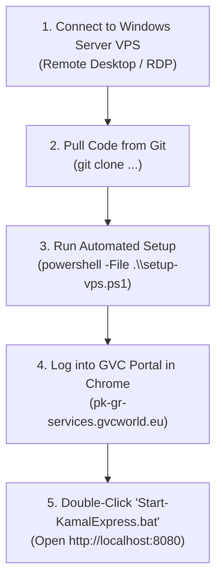

# 🖥️ Kamal Express AI Platform — Windows Server VPS Deployment Guide

This guide covers deploying and operating the **Kamal Express Autonomous Visa & Appointment Platform** on a **Windows Server VPS** (e.g. AWS EC2, Azure VM, Hetzner, Contabo, DigitalOcean Windows Server).

---

## ❓ Do We Need Docker on the Windows Server VPS?

### **Short Answer: NO, Docker is NOT needed (and Native is Recommended).**

### Why Native Execution is Superior on Windows Server:
1. **Chrome CDP Authentication & WAF Bypass**: The platform attaches via Chrome DevTools Protocol (CDP) to a real, authenticated Google Chrome instance running on the Windows desktop. Running natively allows the Python backend to connect directly to Chrome without complex nested container networking or X11/VNC forwarding.
2. **Zero Hyper-V / WSL Virtualization Overhead**: Native execution consumes minimal CPU and RAM (no Docker desktop engine, no WSL2 VM memory reservations).
3. **No Port Binding Conflicts**: Avoids the IPv6/IPv4 Docker proxy conflicts.
4. **Direct Residential Proxy Routing**: Python's `ProxyManager` and Chrome CDP work out of the box with your Pakistan residential IP pool (`data\ips-list-pk.txt`).

---

## 🚀 Step-by-Step Deployment (5 Minutes)



---

### Step 1: Connect to the Windows Server VPS
Connect to your VPS using **Remote Desktop Connection (RDP)**:
- Press `Win + R` → Type `mstsc` → Enter VPS IP and Administrator password.

---

### Step 2: Pull Code from GitHub
Open PowerShell as Administrator on the VPS and run:

```powershell
# Navigate to your desired directory (e.g. C:\ or D:\)
cd C:\

# Clone the repository
git clone <YOUR_GITHUB_REPO_URL> KamalExpress-Agents
cd KamalExpress-Agents
```

*(If Git is not yet installed on the VPS, you can download the repository as a ZIP or let the setup script install tools).*

---

### Step 3: Run the Automated Setup Script
Run the turnkey setup script:

```powershell
powershell -ExecutionPolicy Bypass -File .\setup-vps.ps1
```

#### What `setup-vps.ps1` automatically does:
- ✅ Checks for Google Chrome (downloads and installs Chrome if missing).
- ✅ Checks for Python 3.10+ (downloads and installs Python 3.12 with PATH registration if missing).
- ✅ Creates the Python virtual environment (`venv`).
- ✅ Installs all dependencies from `requirements.txt`.
- ✅ Installs Playwright browser binaries.
- ✅ Creates `.env` and initializes `data\ips-list-pk.txt`.
- ✅ Runs `test_end_to_end.py` self-verification to confirm 100% operational readiness.

---

### Step 4: Sign In to Greece GVC World Portal
1. Open Google Chrome on the VPS desktop via the launcher:
   ```powershell
   .\Launch-Chrome-CDP.ps1 -RealProfile -NoProxy
   ```
2. Navigate to **[https://pk-gr-services.gvcworld.eu](https://pk-gr-services.gvcworld.eu)** and sign into your applicant account.
3. Keep Chrome open. The AI system will automatically detect the active session over CDP.

---

### Step 5: Start the Platform (1-Click)
Double-click:
📁 **`Start-KamalExpress.bat`** (or run `.\start-vps.ps1` in PowerShell).

This starts:
- Chrome CDP listener on port `9222`.
- FastAPI backend server on port `8080`.
- Automatically launches the Web Dashboard at **`http://localhost:8080`**.

---

## 🌐 Remote Access & Firewall (Optional)

If you wish to access the Web Dashboard from your local laptop instead of inside the VPS RDP:

1. Open **Windows Defender Firewall with Advanced Security** on the VPS (or run in PowerShell as Administrator):
   ```powershell
   New-NetFirewallRule -DisplayName "Kamal Express AI Platform" -Direction Inbound -LocalPort 8080 -Protocol TCP -Action Allow
   ```
2. Now access the dashboard from any browser using:
   `http://<YOUR_VPS_PUBLIC_IP>:8080`

---

## 🔄 Automatic Code Updates

[`Start-KamalExpress.bat`](file:///E:/Alamia/KamalExpress-Agents/Start-KamalExpress.bat) and [`start-vps.ps1`](file:///E:/Alamia/KamalExpress-Agents/start-vps.ps1) **automatically run `git pull` on startup** to fetch the latest code from GitHub whenever launched.

To update manually:
```powershell
cd C:\KamalExpress-Agents
git pull origin main
.\venv\Scripts\pip install -r requirements.txt --quiet
```
Restart `Start-KamalExpress.bat` to apply updates immediately.
