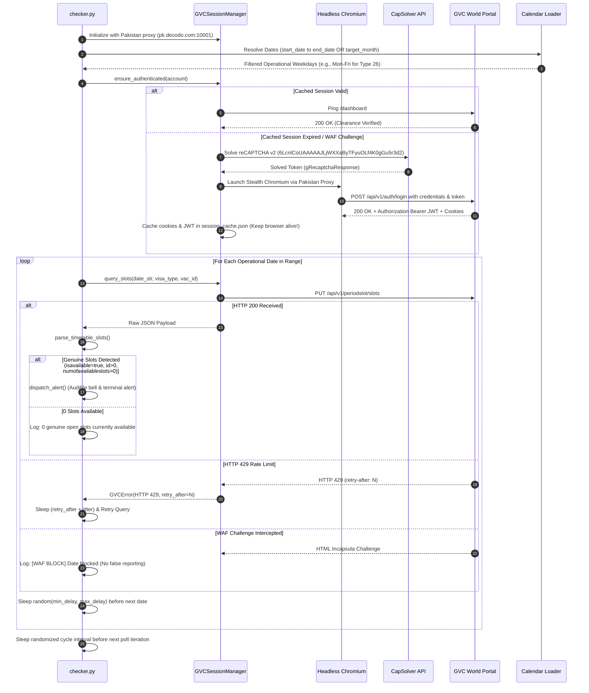
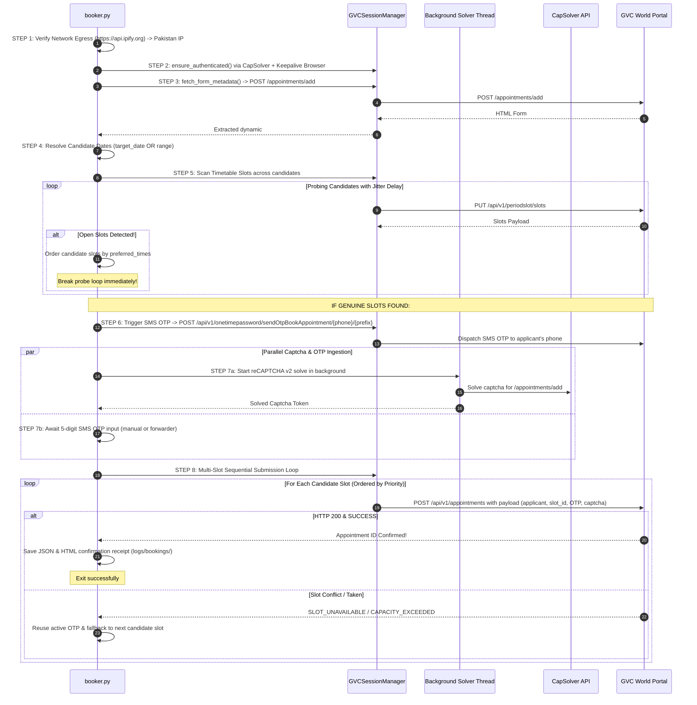

# Standalone Workers Workflow Specification (Scout & Booker)

> **Document Status:** Authoritative Implementation Guide  
> **Target Scope:** Standalone Execution Plane (`standalone_workers/checker.py` and `standalone_workers/booker.py`)  
> **Network Requirements:** Residential Pakistan Proxies (`data/data.txt`) & CapSolver API (`.env`)  
> **Last Verified Run:** 2026-10-02 (Live GVC World Production Portal)

---

## 1. High-Level Architecture Overview

The standalone worker suite provides an autonomous, decoupled solution for monitoring and booking Greece consular appointments on the GVC World portal (`https://pk-gr-services.gvcworld.eu`). The suite consists of two dedicated workers:

```mermaid
flowchart TD
    subgraph SharedInfra [Shared Infrastructure & Utilities]
        direction TB
        ProxyPool["Residential Proxy Pool<br/>(pk.decodo.com:10001+)"]
        CapSolver["CapSolver Engine<br/>(reCAPTCHA v2 Solving)"]
        HeadlessChromium["Persistent Headless Chromium<br/>(Playwright Stealth + Session Maintenance)"]
        CalendarLoader["Operational Calendar<br/>(Weekday & Holiday Rules)"]
        HarRecorder["Live HAR Recorder<br/>(Network Audit Tracing)"]
    end

    subgraph Worker2 [Worker 2: Dedicated Scout (checker.py)]
        direction TB
        ScoutConfig["Scout Config & Date Ranges<br/>(start_date, end_date, target_month)"]
        ScoutPacing["Jittered Pacing Engine<br/>(randomized 3.0s - 12.0s delay)"]
        ScoutQuery["Timetable REST Query<br/>PUT /api/v1/periodslot/slots"]
        ScoutAudit["Contract Validator<br/>(Rejects null ID / 0 availability)"]
        ScoutAlert["Audible & Visual Alert<br/>(Zero false positives)"]
    end

    subgraph Worker1 [Worker 1: Autonomous Booker (booker.py)]
        direction TB
        ClientIntake["Client Intake<br/>(clients.txt / JSON profile)"]
        MetaScrape["Dynamic Form Scrape<br/>POST /appointments/add (#otpuser, #vac)"]
        DropScan["Candidate Slot Prober<br/>(Single Date or Short Window)"]
        ParallelAction["Parallel reCAPTCHA Solve & OTP Await"]
        BookingSubmit["Final Submission Loop<br/>POST /api/v1/appointments"]
        ReceiptGen["Receipt & Confirmation<br/>(HTML & JSON logs)"]
    end

    SharedInfra --> Worker2
    SharedInfra --> Worker1
```

### Core Invariants Proven in Production
1. **Zero False Positives:** Slots are only considered genuine if `id > 0`, `isavailable == True`, and `numofavailableslots > 0`. Null IDs or unselectable intervals are strictly discarded.
2. **Persistent Headless Browser:** Closing the browser immediately after authentication drops Imperva WAF session heartbeats. The workers maintain an active headless Chromium instance in memory during execution.
3. **Adaptive HTTP 429 Resilience:** Fast sequential scans trigger Imperva/GVC rate limits. Workers enforce randomized human-like delays (`3.0s` to `12.0s`) and honor the server's `retry-after` header (`backoff = retry_after + jitter`).
4. **Calendar Rules Enforced:** Dates are pre-filtered against consular operational rules (e.g., Visa Type 26 is only queried Mon–Fri; Saturday and Sunday are never queried).

---

## 2. Configuration & Parameter Hierarchy

Both workers read from `standalone_workers/config.json` and accept command-line flag overrides.

### `config.json` Schema
```json
{
  "mode": "drop",
  "vac": "137",
  "visa_type": "26",
  "target_month": "10/2026",
  "target_date": "",
  "start_date": "11/10/2026",
  "end_date": "14/10/2026",
  "min_delay": 3.0,
  "max_delay": 12.0,
  "preferred_times": ["09:30", "10:00", "11:30"],
  "applicant_file": "standalone_workers/data/applicants/sample_applicant.json",
  "account_file": "standalone_workers/data/accounts/sample_account.json",
  "proxy_string": "",
  "portal_base_url": "https://pk-gr-services.gvcworld.eu",
  "otp_timeout": 180,
  "save_har": true,
  "use_mock_captcha": false
}
```

### Environment Variables (`.env`)
- `CAPSOLVER_API_KEY`: API key for CapSolver (auto-loaded; no hardcoded keys in config).

---

## 3. Worker 2: Scout Workflow (`checker.py`)

### Step-by-Step Technical Execution



### Scout CLI Usage Examples
```powershell
# Run single pass using dates configured in config.json:
python standalone_workers/checker.py --single-run

# Run single pass for a custom range with custom jittered delays:
python standalone_workers/checker.py --single-run --start-date 12/10/2026 --end-date 16/10/2026 --min-delay 4.0 --max-delay 12.0 --vac 137 --visa-type 26

# Continuous scouting with custom polling interval:
python standalone_workers/checker.py --start-date 11/10/2026 --end-date 14/10/2026 --interval 30
```

---

## 4. Worker 1: Autonomous Booker Workflow (`booker.py`)

### Step-by-Step Technical Execution



### Booker CLI Usage Examples
```powershell
# Drop mode targeting dates configured in config.json:
python standalone_workers/booker.py --drop

# Drop mode targeting an exact single drop date:
python standalone_workers/booker.py --drop --target-date 07/10/2026 --vac 137 --visa-type 26

# Targeting a specific client from clients.txt by index or passport:
python standalone_workers/booker.py --drop --target-date 07/10/2026 --client-index 0
python standalone_workers/booker.py --drop --target-date 07/10/2026 --passport FR321456
```

---

## 5. Verification Records & Audit Artifacts

All live transactions generate structured audit files:

1. **HAR Traffic Traces (`logs/hars/`):**
   - Every HTTP transaction (method, URL, headers, status, response text, timings) is recorded.
   - Verified clean HAR files:
     - `checker_run_20261002_171048.har` (Scout multi-date run)
     - `booker_run_20261002_172415.har` (Booker multi-date probe)
2. **Session Cache (`standalone_workers/data/session_cache.json`):**
   - Persists the active `auth_token` and clearance cookies across runs.
3. **Booking Receipts (`logs/bookings/`):**
   - Generates `booking_<id>_<timestamp>.json` and `booking_<id>_<timestamp>.html` upon successful confirmation.

---

## 6. Comparative Mapping: Manual Consular Workflow vs. Standalone Worker Code

This section provides an exact, side-by-side comparison between the actions performed manually by a human user in a browser (as captured in `manual-pk-gr-services.gvcworld.eu.har`) and the automated execution steps implemented in the standalone worker scripts.

### 6.1 Availability Check Workflow (Manual vs. Scout `checker.py`)

| Step # | Human Manual Browser Action | GVC Network Interaction (HAR) | Automated Worker Step | Code Implementation & Line Reference |
| :---: | :--- | :--- | :--- | :--- |
| **M-1** | User opens Chrome with Pakistan IP/residential VPN and navigates to `https://pk-gr-services.gvcworld.eu/?lang=en_US`. | `GET /?lang=en_US`<br/>Imperva sets `visid_incap_*` & `incap_ses_*`. | **Proxy Assignment & Egress:** Session manager binds to Pakistan residential proxy (`pk.decodo.com:10001`). | [`checker.py`: lines 89–106](file:///e:/Alamia/KamalExpress-Agents/standalone_workers/checker.py#L89-L106)<br/>[`session_manager.py`: lines 80–103](file:///e:/Alamia/KamalExpress-Agents/standalone_workers/utils/session_manager.py#L80-L103) |
| **M-2** | User fills username (`amr.shah@gmail.com`), password, clicks reCAPTCHA v2 checkbox, and clicks **Log in**. | `POST /api/v1/auth/login`<br/>Returns `Authorization: Bearer <jwt>` and sets `auth_token` cookie. | **CapSolver + Stealth Login:** Solves reCAPTCHA v2 in background, performs login handshake via Playwright Stealth, and captures JWT/cookies. | [`checker.py`: lines 144–156](file:///e:/Alamia/KamalExpress-Agents/standalone_workers/checker.py#L144-L156)<br/>[`session_manager.py`: lines 192–314](file:///e:/Alamia/KamalExpress-Agents/standalone_workers/utils/session_manager.py#L192-L314) |
| **M-3** | Browser navigates to applicant dashboard after successful authentication. | `GET /dashboard`<br/>HTTP 200 OK. | **Session Validation & Cache:** Reuses cached session token or verifies active state against `/dashboard`. Headless browser stays alive. | [`session_manager.py`: lines 172–190](file:///e:/Alamia/KamalExpress-Agents/standalone_workers/utils/session_manager.py#L172-L190)<br/>[`session_manager.py`: lines 315–326](file:///e:/Alamia/KamalExpress-Agents/standalone_workers/utils/session_manager.py#L315-L326) |
| **M-4** | User clicks **Book Appointment** and selects Visa Type and VAC Center. | `POST /appointments/add`<br/>Loads hidden `#otpuser` and `#vac` fields. | **Calendar Filter:** Resolves configured start/end dates against official GVC operating weekday rules (e.g. Type 26: Mon–Fri). | [`checker.py`: lines 114–143](file:///e:/Alamia/KamalExpress-Agents/standalone_workers/checker.py#L114-L143)<br/>[`calendar_loader.py`: lines 85–116](file:///e:/Alamia/KamalExpress-Agents/standalone_workers/utils/calendar_loader.py#L85-L116) |
| **M-5** | User clicks calendar date(s) to view available timetable slots. | `PUT /api/v1/periodslot/slots`<br/>Payload: `{"datefrom":"DD/MM/YYYY", "type":26, "vac":{"id":137}}` | **Timetable Query with Jittered Pacing:** Queries `PUT /api/v1/periodslot/slots` with human-like randomized delays (`3.0s` to `12.0s`) to prevent HTTP 429. | [`checker.py`: lines 173–215](file:///e:/Alamia/KamalExpress-Agents/standalone_workers/checker.py#L173-L215)<br/>[`session_manager.py`: lines 403–452](file:///e:/Alamia/KamalExpress-Agents/standalone_workers/utils/session_manager.py#L403-L452) |
| **M-6** | User inspects calendar UI: grayed-out slots mean closed/full; green slot means available. | JSON response: `isavailable: false`, `numofavailableslots: 0`, `id: null`. | **Contract Parsing & Zero False Reporting:** Evaluates timetable items: requires `id > 0`, `isavailable == True`, and `numofavailableslots > 0`. | [`checker.py`: lines 177–181](file:///e:/Alamia/KamalExpress-Agents/standalone_workers/checker.py#L177-L181)<br/>[`slot_traversal.py`: lines 24–65](file:///e:/Alamia/KamalExpress-Agents/standalone_workers/utils/slot_traversal.py#L24-L65) |
| **M-7** | If no slots, user waits 15–30 seconds and checks again. | User repeats calendar clicks. | **Polling Cycle with Randomized Interval:** Awaits jittered interval (`interval ± 25%`) and loops to next polling iteration. | [`checker.py`: lines 230–235](file:///e:/Alamia/KamalExpress-Agents/standalone_workers/checker.py#L230-L235) |

---

### 6.2 Booking Submission Workflow (Manual vs. Autonomous Booker `booker.py`)

| Step # | Human Manual Browser Action | GVC Network Interaction (HAR) | Automated Worker Step | Code Implementation & Line Reference |
| :---: | :--- | :--- | :--- | :--- |
| **B-1** | User opens browser with Pakistan proxy and logs in. | `POST /api/v1/auth/login`<br/>Captures clearance cookies & Bearer JWT. | **Step 1 & 2: Egress Check & Autonomous Authentication:** Verifies exit IP (`api.ipify.org`), authenticates via CapSolver, and keeps Chromium active. | [`booker.py`: lines 234–244](file:///e:/Alamia/KamalExpress-Agents/standalone_workers/booker.py#L234-L244)<br/>[`session_manager.py`: lines 145–154](file:///e:/Alamia/KamalExpress-Agents/standalone_workers/utils/session_manager.py#L145-L154) |
| **B-2** | User opens `/appointments/add` page to render booking form. | `POST /appointments/add`<br/>Renders hidden DOM fields: `otpuser`, `vac`, `submissionMsgCheck`. | **Step 3: Dynamic Form Scrape:** Scrapes dynamic `#otpuser` (336 chars) and `#vac` values directly from HTML response. | [`booker.py`: lines 245–250](file:///e:/Alamia/KamalExpress-Agents/standalone_workers/booker.py#L245-L250)<br/>[`session_manager.py`: lines 327–374](file:///e:/Alamia/KamalExpress-Agents/standalone_workers/utils/session_manager.py#L327-L374) |
| **B-3** | User verifies the date they want to book is active for the visa type. | Manual calendar view. | **Step 4: Operational Calendar Validation:** Validates requested date or range against consular rules (Mon–Fri for Type 26). | [`booker.py`: lines 251–283](file:///e:/Alamia/KamalExpress-Agents/standalone_workers/booker.py#L251-L283)<br/>[`calendar_loader.py`: lines 46–71](file:///e:/Alamia/KamalExpress-Agents/standalone_workers/utils/calendar_loader.py#L46-L71) |
| **B-4** | User clicks the target date; browser queries slots for that date. | `PUT /api/v1/periodslot/slots`<br/>Returns timetable slots array. | **Step 5: Slot Discovery & Ordering:** Probes candidate dates with randomized delays, detects genuine slots, and prioritizes by preferred times. | [`booker.py`: lines 284–351](file:///e:/Alamia/KamalExpress-Agents/standalone_workers/booker.py#L284-L351)<br/>[`slot_traversal.py`: lines 68–95](file:///e:/Alamia/KamalExpress-Agents/standalone_workers/utils/slot_traversal.py#L68-L95) |
| **B-5** | User enters applicant's phone number and clicks **Send OTP**. | `POST /api/v1/onetimepassword/sendOtpBookAppointment/{phone}/{prefix}` | **Step 6: Single-Dispatch SMS OTP:** Dispatches OTP request to applicant's phone number (`+92-...`) via official API endpoint. | [`booker.py`: lines 353–359](file:///e:/Alamia/KamalExpress-Agents/standalone_workers/booker.py#L353-L359)<br/>[`session_manager.py`: lines 453–469](file:///e:/Alamia/KamalExpress-Agents/standalone_workers/utils/session_manager.py#L453-L469) |
| **B-6** | User solves the on-page reCAPTCHA v2 while applicant receives SMS. | User manually solves captcha checkbox / images in browser. | **Step 7a: Parallel reCAPTCHA v2 Solving:** Background `SolverThread` queries CapSolver API simultaneously without blocking execution. | [`booker.py`: lines 75–126](file:///e:/Alamia/KamalExpress-Agents/standalone_workers/booker.py#L75-L126)<br/>[`booker.py`: lines 360–370](file:///e:/Alamia/KamalExpress-Agents/standalone_workers/booker.py#L360-L370) |
| **B-7** | Applicant reads SMS code to staff; staff types 5-digit OTP into input field. | DOM input typing into `#onetimepassword`. | **Step 7b: OTP Ingestion:** Awaits 5-digit code via interactive terminal prompt or automated webhook forwarder. | [`booker.py`: lines 371–396](file:///e:/Alamia/KamalExpress-Agents/standalone_workers/booker.py#L371-L396) |
| **B-8** | User fills applicant passport info, checks consent, and clicks **Submit**. | `POST /api/v1/appointments`<br/>Sends applicant object, slot ID, date, time, OTP, and captcha token. | **Step 8: Sequential Multi-Slot Submission:** Submits full booking payload. If first slot is taken, reuses OTP to submit next candidate slot. | [`booker.py`: lines 401–437](file:///e:/Alamia/KamalExpress-Agents/standalone_workers/booker.py#L401-L437)<br/>[`session_manager.py`: lines 471–533](file:///e:/Alamia/KamalExpress-Agents/standalone_workers/utils/session_manager.py#L471-L533) |
| **B-9** | Browser redirects to confirmation page with Appointment Reference Number. | `GET /appointments/result/{appt_id}`<br/>Displays official booking confirmation page. | **Receipt Generation:** Captures confirmed appointment ID, writes JSON receipt and full HTML confirmation to `logs/bookings/`. | [`booker.py`: lines 439–483](file:///e:/Alamia/KamalExpress-Agents/standalone_workers/booker.py#L439-L483)<br/>[`session_manager.py`: lines 535–544](file:///e:/Alamia/KamalExpress-Agents/standalone_workers/utils/session_manager.py#L535-L544) |
| **B-10** | User closes browser. | Session ends. | **Clean Exit & HAR Export:** Closes background browser and exports live `.har` network audit trace. | [`booker.py`: lines 484–490](file:///e:/Alamia/KamalExpress-Agents/standalone_workers/booker.py#L484-L490) |

